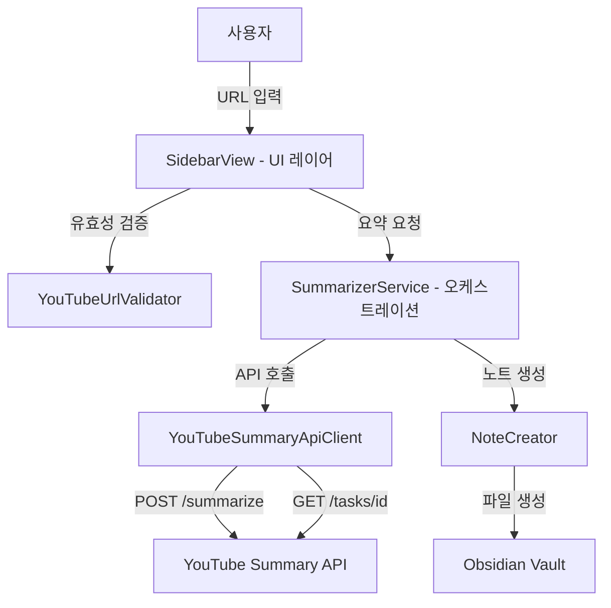

# 기술 설계 문서: API 마이그레이션

## 개요 (Overview)

Obsidian YouTube Summarizer 플러그인의 백엔드를 자체 구현(YouTubeDataFetcher + AWS Bedrock)에서 외부 YouTube Summary API(`https://api.rastalion.me/yts/api`)로 전면 교체한다.

기존 플러그인은 유튜브 페이지 HTML 파싱으로 자막을 추출하고, AWS Bedrock Claude를 직접 호출하여 요약을 생성했다. 이 방식은 AWS 자격 증명 관리, 유튜브 HTML 구조 변경에 대한 취약성, 복잡한 설정(리전, 모델 ID, Access Key, Secret Key, 프롬프트) 등의 문제가 있었다.

마이그레이션 후 플러그인의 역할은 다음으로 단순화된다:

1. 사용자가 사이드바에서 유튜브 URL 입력
2. URL 유효성 검증
3. YouTube Summary API에 요약 요청 (POST /summarize)
4. 작업 상태 폴링 (GET /tasks/{task_id}) → 진행 단계 UI 표시
5. 완료된 결과로 마크다운 노트 생성

설정은 API Key 하나와 저장 폴더, 언어 선택만 남는다.

## 아키텍처 (Architecture)

### 전체 구조



### 모듈 구성 (마이그레이션 후)

```
src/
├── main.ts                         # 플러그인 진입점
├── views/
│   └── SidebarView.ts              # 사이드바 패널 UI (스크립트 textarea 제거)
├── services/
│   ├── SummarizerService.ts        # 요약 프로세스 오케스트레이션 (리팩토링)
│   ├── YouTubeSummaryApiClient.ts  # 신규: 외부 API 클라이언트
│   └── NoteCreator.ts              # 마크다운 노트 생성 (keyPoints 추가)
├── utils/
│   └── YouTubeUrlValidator.ts      # URL 유효성 검증 (변경 없음)
├── models/
│   └── types.ts                    # 타입 정의 (AWS 제거, API 타입 추가)
├── settings/
│   └── SettingsTab.ts              # 설정 탭 (API Key만)
└── i18n/
    └── index.ts                    # 다국어 지원 (키 교체)
```

**제거 대상:**
- `src/services/BedrockClient.ts` — AWS Bedrock 직접 호출 클라이언트
- `src/services/YouTubeDataFetcher.ts` — 유튜브 HTML 파싱 자막/메타데이터 추출
- 위 두 파일의 모든 테스트 파일 (`.test.ts`, `.property.test.ts`)

### 설계 결정 사항

1. **HTTP 클라이언트**: 옵시디언의 `requestUrl` API를 사용한다. 옵시디언 플러그인은 Node.js `fetch`나 `XMLHttpRequest`를 직접 사용할 수 없으며, `requestUrl`이 CORS 제약 없이 외부 API를 호출할 수 있는 공식 방법이다.

2. **폴링 전략**: 3초 간격으로 `GET /tasks/{task_id}`를 호출하며, 최대 60회(약 3분)까지 폴링한다. API의 파이프라인(자막 추출 → 번역 → 요약)이 수 분 소요될 수 있으므로 충분한 타임아웃을 확보한다.

3. **수동 스크립트 입력 제거**: API가 자막 추출, 음성 인식 폴백, 번역을 모두 처리하므로 사용자가 직접 스크립트를 붙여넣을 필요가 없다.

4. **프롬프트 설정 제거**: API 서버 측에서 장르 감지 및 요약 프롬프트를 관리하므로, 플러그인에서 프롬프트 편집 기능을 제거한다.

5. **NoteContent 확장**: API 응답의 `key_points` 배열을 노트에 "핵심 인사이트" 섹션으로 포함한다. 기존 `isFallbackSummary` 필드는 제거하고, API가 추출 방식(`extraction_method`)을 알려주므로 이를 활용한다.


## 컴포넌트 및 인터페이스 (Components and Interfaces)

### 1. YouTubeSummaryApiClient (신규: services/YouTubeSummaryApiClient.ts)

YouTube Summary API와의 모든 HTTP 통신을 담당하는 클라이언트. 옵시디언의 `requestUrl`을 사용한다.

```typescript
// API 오류 타입
class ApiError extends Error {
  code: string;       // MISSING_API_KEY, INVALID_API_KEY, INVALID_URL, TASK_NOT_FOUND, PIPELINE_ERROR, SERVICE_TIMEOUT, INTERNAL_ERROR
  statusCode: number; // HTTP 상태 코드
}

class YouTubeSummaryApiClient {
  constructor(apiKey: string, requestFn?: RequestFn);

  // POST /summarize — 요약 작업 생성
  async submitSummarize(url: string, targetLanguage: string): Promise<SummarizeApiResponse>;

  // GET /tasks/{task_id} — 작업 상태 조회
  async getTaskStatus(taskId: string): Promise<TaskStatusResponse>;
}
```

`requestFn`은 테스트 시 `requestUrl`을 모킹하기 위한 선택적 의존성 주입 파라미터이다.

### 2. SummarizerService (리팩토링: services/SummarizerService.ts)

기존 YouTubeDataFetcher + BedrockClient 의존성을 YouTubeSummaryApiClient로 교체한다.

```typescript
class SummarizerService {
  constructor(
    apiClient: YouTubeSummaryApiClient,
    noteCreator: NoteCreator
  );

  async summarize(
    videoUrl: string,
    targetLanguage: string,
    onProgress: ProgressCallback
  ): Promise<TFile>;
}
```

내부 플로우:
1. `apiClient.submitSummarize(url, language)` → `task_id` 수신
2. 3초 간격 폴링: `apiClient.getTaskStatus(task_id)` → 상태 변경 시 `onProgress` 콜백 호출
3. `completed` 시 `noteCreator.createNote(...)` 호출
4. `failed` 시 API 오류 메시지를 포함한 Error throw

### 3. NoteCreator (수정: services/NoteCreator.ts)

`NoteContent`에 `keyPoints` 필드가 추가되어 "핵심 인사이트" 섹션을 생성한다.

```typescript
interface NoteContent {
  videoTitle: string;
  videoUrl: string;
  summary: string;
  keyPoints: string[];  // 신규: 핵심 인사이트 배열
}

class NoteCreator {
  constructor(app: App, savePath: string);
  generateMarkdown(content: NoteContent): string;
  async resolveFilePath(title: string): Promise<string>;
  async createNote(content: NoteContent): Promise<TFile>;
}
```

### 4. SidebarView (수정: views/SidebarView.ts)

- 스크립트 직접 입력 textarea 제거
- `SummaryStage` 매핑을 API 작업 상태에 맞게 업데이트
- `handleSummarize()`에서 API Key 미설정 사전 검증 추가
- `summarize()` 호출 시그니처 변경 (prompt, manualTranscript 파라미터 제거)

### 5. SettingsTab (수정: settings/SettingsTab.ts)

- AWS 관련 설정 UI 전체 제거 (리전, Access Key, Secret Key, 모델 선택)
- 프롬프트 편집 모달 및 버튼 제거
- API Key 입력 텍스트 필드 추가
- `BedrockClient` import 제거

### 6. main.ts (수정)

서비스 팩토리에서 `YouTubeDataFetcher`, `BedrockClient` 생성을 제거하고, `YouTubeSummaryApiClient`를 생성하여 `SummarizerService`에 주입한다.

```typescript
const serviceFactory = () => {
  const apiClient = new YouTubeSummaryApiClient(this.settings.apiKey);
  const noteCreator = new NoteCreator(this.app, this.settings.saveFolderPath);
  return new SummarizerService(apiClient, noteCreator);
};
```

## 데이터 모델 (Data Models)

### PluginSettings (변경)

```typescript
interface PluginSettings {
  language: Language;       // UI 표시 언어 (유지)
  saveFolderPath: string;   // 노트 저장 폴더 경로 (유지)
  apiKey: string;           // 신규: YouTube Summary API 인증 키
}

const DEFAULT_SETTINGS: PluginSettings = {
  language: "en",
  saveFolderPath: "YouTube Summaries",
  apiKey: "",
};
```

**제거된 필드:** `summaryPrompt`, `awsRegion`, `bedrockModelId`, `awsAccessKeyId`, `awsSecretAccessKey`

### SummaryStage (변경)

API 작업 상태 흐름에 맞게 재정의한다.

```typescript
enum SummaryStage {
  VALIDATING = "stageValidating",
  PENDING = "stagePending",
  EXTRACTING = "stageExtracting",
  TRANSLATING = "stageTranslating",
  SUMMARIZING = "stageSummarizing",
  CREATING_NOTE = "stageCreatingNote",
  COMPLETE = "stageComplete",
}
```

**제거된 단계:** `FETCHING_METADATA`, `FETCHING_TRANSCRIPT`
**추가된 단계:** `PENDING`, `EXTRACTING`, `TRANSLATING`

### API 요청/응답 타입 (신규)

```typescript
// POST /summarize 요청 본문
interface SummarizeApiRequest {
  url: string;
  target_language: string;
}

// POST /summarize 응답 (202)
interface SummarizeApiResponse {
  task_id: string;
  status: string;
}

// GET /tasks/{task_id} 응답
interface TaskStatusResponse {
  task_id: string;
  status: "pending" | "extracting" | "translating" | "summarizing" | "completed" | "failed";
  result: ApiResult | null;
  error: ApiErrorDetail | null;
}

// 완료 시 결과 객체
interface ApiResult {
  video_title: string;
  original_language: string;
  extraction_method: "subtitle" | "transcribe";
  translated_text: string;
  summary: string;
  key_points: string[];
}

// 오류 상세
interface ApiErrorDetail {
  code: string;
  message: string;
}
```

### NoteContent (변경)

```typescript
interface NoteContent {
  videoTitle: string;     // API 응답의 video_title
  videoUrl: string;       // 원본 유튜브 URL
  summary: string;        // API 응답의 summary (마크다운)
  keyPoints: string[];    // API 응답의 key_points 배열
}
```

**제거된 필드:** `videoId`, `isFallbackSummary`
**추가된 필드:** `keyPoints`

`videoId`는 더 이상 별도로 필요하지 않다. API가 영상 제목을 직접 반환하고, 임베딩 URL은 사용자가 입력한 원본 `videoUrl`을 그대로 사용한다.

### 요약 노트 마크다운 템플릿 (변경)

```markdown
---
tags:
  - youtube-summary
date: {YYYY-MM-DD}
url: {원본 유튜브 URL}
---

# {video_title}


---

## 요약

{API summary 마크다운 내용}

## 핵심 인사이트

- {key_points[0]}
- {key_points[1]}
- {key_points[2]}
...
```

**변경 사항:**
- `isFallbackSummary` callout 제거 (API가 자막 없는 경우 음성 인식 폴백을 자체 처리)
- "핵심 인사이트" 섹션 추가 (`key_points` 배열을 목록으로 렌더링)

### i18n 키 변경

**제거:**
- AWS 관련: `awsRegionLabel`, `awsRegionDesc`, `accessKeyLabel`, `accessKeyDesc`, `secretKeyLabel`, `secretKeyDesc`, `modelLabel`, `modelDesc`
- 프롬프트 관련: `summaryPromptLabel`, `summaryPromptDesc`, `editPromptButton`, `promptModalTitle`, `promptModalSave`, `promptModalCancel`
- 스크립트 관련: `scriptLabel`, `scriptPlaceholder`, `scriptHint`
- 기존 진행 단계: `stageFetchingMetadata`, `stageFetchingTranscript`

**추가:**
- API Key 설정: `apiKeyLabel`, `apiKeyDesc`
- 진행 단계: `stagePending`, `stageExtracting`, `stageTranslating`
- 오류 메시지: `errorInvalidApiKey`, `errorApiConnection`, `errorApiTimeout`, `errorMissingApiKey`

