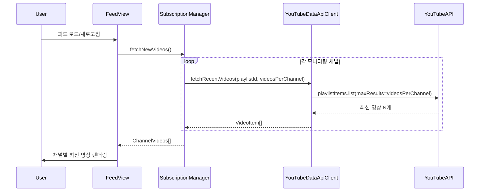

# 설계 문서: 최신 영상 피드 (latest-videos-feed)

## 개요

기존 구독 피드는 `lastCheckedAt` 시점 이후에 업로드된 영상만 필터링하여 표시했다. 이 방식은 사용자가 피드를 오래 열지 않으면 대량의 영상이 한꺼번에 표시되고, 반대로 자주 열면 빈 피드가 표시되는 문제가 있었다.

이번 변경은 시간 기반 필터링을 제거하고, 각 구독 채널의 최신 영상 N개(기본 3개)를 항상 표시하는 방식으로 전환한다. 사용자는 설정에서 채널당 영상 개수(1~10)를 조정할 수 있다.

### 핵심 변경 요약

- `SubscriptionManager.fetchNewVideos()`에서 `lastCheckedAt` 기반 필터링 제거
- `YouTubeDataApiClient.fetchRecentVideos()` 호출 시 `maxResults`를 `videosPerChannel` 값으로 전달
- `PluginSettings`에 `videosPerChannel` 필드 추가, `lastCheckedAt` 필드 제거
- `filterNewVideos()`, `updateLastCheckedAt()` 메서드 제거
- 설정 UI에 채널당 영상 개수 슬라이더 추가

## 아키텍처

기존 아키텍처를 유지하면서 데이터 흐름만 단순화한다.



### 변경 전 vs 변경 후

| 항목 | 변경 전 | 변경 후 |
|------|---------|---------|
| API 호출 | `maxResults=10` (고정) | `maxResults=videosPerChannel` (설정값) |
| 필터링 | `lastCheckedAt` 이후 영상만 | 없음 (API 응답 그대로 사용) |
| 표시 영상 수 | 가변 (0~10개) | 고정 (채널당 N개) |
| 설정 필드 | `lastCheckedAt: Record<string, string>` | `videosPerChannel: number` |

## 컴포넌트 및 인터페이스

### 1. SubscriptionManager (수정)

**파일:** `src/services/SubscriptionManager.ts`

**변경 사항:**
- `fetchNewVideos()`: `lastCheckedAt` 필터링 제거, `videosPerChannel`을 `maxResults`로 전달
- `filterNewVideos()`: 메서드 삭제
- `updateLastCheckedAt()`: 메서드 삭제

```typescript
// 변경 후 fetchNewVideos
async fetchNewVideos(): Promise<ChannelVideos[]> {
  const results: ChannelVideos[] = [];
  const { monitoredChannels, videosPerChannel } = this.settings;

  for (const channel of monitoredChannels) {
    try {
      const playlistId = this.getUploadsPlaylistId(channel.channelId);
      const response = await this.apiClient.fetchRecentVideos(playlistId, videosPerChannel);

      if (response.items.length > 0) {
        results.push({
          channelId: channel.channelId,
          channelTitle: channel.channelTitle,
          videos: response.items,
        });
      }
    } catch {
      continue;
    }
  }

  return results;
}
```

### 2. PluginSettings (수정)

**파일:** `src/models/types.ts`

**변경 사항:**
- `videosPerChannel: number` 필드 추가 (기본값: 3)
- `lastCheckedAt: Record<string, string>` 필드 제거

### 3. SettingsTab (수정)

**파일:** `src/settings/SettingsTab.ts`

**변경 사항:**
- 구독 피드 섹션에 채널당 영상 개수 설정 UI 추가 (슬라이더, 범위 1~10)

### 4. FeedView (수정)

**파일:** `src/views/FeedView.ts`

**변경 사항:**
- `summarizeVideo()` 내 `updateLastCheckedAt()` 호출 제거

### 5. i18n (수정)

**파일:** `src/i18n/index.ts`

**변경 사항:**
- `videosPerChannelLabel`, `videosPerChannelDesc` 번역 키 추가

## 데이터 모델

### PluginSettings 변경

```typescript
// 변경 전
export interface PluginSettings {
  language: Language;
  saveFolderPath: string;
  apiKey: string;
  youtubeDataApiKey: string;
  monitoredChannels: MonitoredChannel[];
  subscriptionSaveFolderPath: string;
  lastCheckedAt: Record<string, string>;  // 제거
}

// 변경 후
export interface PluginSettings {
  language: Language;
  saveFolderPath: string;
  apiKey: string;
  youtubeDataApiKey: string;
  monitoredChannels: MonitoredChannel[];
  subscriptionSaveFolderPath: string;
  videosPerChannel: number;  // 추가 (기본값: 3, 범위: 1~10)
}
```

### DEFAULT_SETTINGS 변경

```typescript
export const DEFAULT_SETTINGS: PluginSettings = {
  language: "en",
  saveFolderPath: "YouTube Summaries",
  apiKey: "",
  youtubeDataApiKey: "",
  monitoredChannels: [],
  subscriptionSaveFolderPath: "YouTube Subscriptions",
  videosPerChannel: 3,  // 추가
  // lastCheckedAt 제거
};
```

### 하위 호환성

`Object.assign({}, DEFAULT_SETTINGS, await this.loadData())`로 설정을 로드하므로, 기존 저장 데이터에 `lastCheckedAt`이 있어도 새 `PluginSettings` 인터페이스에서 해당 필드가 없으므로 자연스럽게 무시된다. `videosPerChannel`이 없는 기존 데이터는 `DEFAULT_SETTINGS`의 기본값 3이 적용된다.


## 정확성 속성 (Correctness Properties)

*속성(property)이란 시스템의 모든 유효한 실행에서 참이어야 하는 특성 또는 동작이다. 속성은 사람이 읽을 수 있는 명세와 기계가 검증할 수 있는 정확성 보장 사이의 다리 역할을 한다.*

### Property 1: API 응답 무필터 반환

*For any* 모니터링 채널 목록과 videosPerChannel 값에 대해, `fetchNewVideos()`가 반환하는 각 채널의 영상 목록은 API 클라이언트가 반환한 영상 목록과 정확히 동일해야 한다 (필터링이나 누락 없이).

**Validates: Requirements 1.1, 1.2, 2.2, 2.3**

### Property 2: maxResults에 videosPerChannel 전달

*For any* 1~10 범위의 videosPerChannel 값에 대해, `fetchNewVideos()` 실행 시 각 채널의 `fetchRecentVideos()` 호출에 전달되는 `maxResults` 인자는 `settings.videosPerChannel` 값과 정확히 일치해야 한다.

**Validates: Requirements 1.3, 3.3**

### Property 3: videosPerChannel 범위 제한

*For any* 정수 값에 대해, 설정 UI에서 videosPerChannel을 변경할 때 저장되는 값은 항상 1 이상 10 이하의 정수여야 한다. 범위 밖의 값은 가장 가까운 경계값으로 클램핑된다.

**Validates: Requirements 3.4**

### Property 4: 개별 채널 실패 시 격리

*For any* 모니터링 채널 목록에서 일부 채널의 API 호출이 실패하더라도, 성공한 채널의 영상은 모두 결과에 포함되어야 하며, 실패한 채널은 결과에서 제외되어야 한다.

**Validates: Requirements 5.4**


## 오류 처리

### 개별 채널 API 호출 실패
- 기존과 동일하게 `try/catch`로 개별 채널 실패를 격리
- 실패한 채널은 건너뛰고 나머지 채널의 영상을 계속 반환

### videosPerChannel 유효성 검증
- 설정 UI에서 `Math.min(10, Math.max(1, Math.round(value)))`로 클램핑
- `DEFAULT_SETTINGS.videosPerChannel = 3`으로 기본값 보장

### 하위 호환성
- 기존 저장 데이터에 `lastCheckedAt`이 있어도 `Object.assign` 병합 시 새 인터페이스에서 사용하지 않으므로 무시됨
- `videosPerChannel`이 없는 기존 데이터는 `DEFAULT_SETTINGS`의 기본값 3이 적용됨

## 테스트 전략

### 속성 기반 테스트 (Property-Based Testing)

라이브러리: `fast-check` (이미 프로젝트에 설치됨)

각 속성 테스트는 최소 100회 반복 실행하며, 설계 문서의 속성 번호를 태그로 참조한다.

| 속성 | 테스트 파일 | 태그 |
|------|------------|------|
| Property 1 | `SubscriptionManager.property.test.ts` | Feature: latest-videos-feed, Property 1: API 응답 무필터 반환 |
| Property 2 | `SubscriptionManager.property.test.ts` | Feature: latest-videos-feed, Property 2: maxResults에 videosPerChannel 전달 |
| Property 3 | `SettingsTab.property.test.ts` | Feature: latest-videos-feed, Property 3: videosPerChannel 범위 제한 |
| Property 4 | `SubscriptionManager.property.test.ts` | Feature: latest-videos-feed, Property 4: 개별 채널 실패 시 격리 |

### 단위 테스트

속성 테스트가 범용적 입력을 커버하므로, 단위 테스트는 다음에 집중한다:

- **예제 테스트**: `DEFAULT_SETTINGS.videosPerChannel === 3` 확인 (Requirements 3.1)
- **예제 테스트**: 설정 UI에서 videosPerChannel 변경 시 저장 확인 (Requirements 3.2)
- **예제 테스트**: 기존 `lastCheckedAt` 데이터가 있는 설정 로드 시 정상 동작 (Requirements 4.5)
- **예제 테스트**: 빈 영상 목록일 때 빈 피드 메시지 표시 (Requirements 5.2)
- **기존 테스트 수정**: `filterNewVideos`, `updateLastCheckedAt` 관련 테스트 제거
- **기존 테스트 수정**: `fetchNewVideos` 테스트에서 `lastCheckedAt` 의존성 제거

### 기존 테스트 영향 분석

| 파일 | 영향 | 조치 |
|------|------|------|
| `SubscriptionManager.test.ts` | `filterNewVideos`, `updateLastCheckedAt` 테스트 제거 필요 | 삭제 및 새 테스트 추가 |
| `SubscriptionManager.property.test.ts` | Property 4 (신규 영상 필터링) 제거, 새 속성 추가 | 교체 |
| `FeedView.test.ts` | `updateLastCheckedAt` 모킹 제거 | 수정 |
| `SettingsTab.test.ts` | videosPerChannel 설정 테스트 추가 | 추가 |
| `main.test.ts` | `lastCheckedAt` 관련 테스트 수정 | 수정 |
