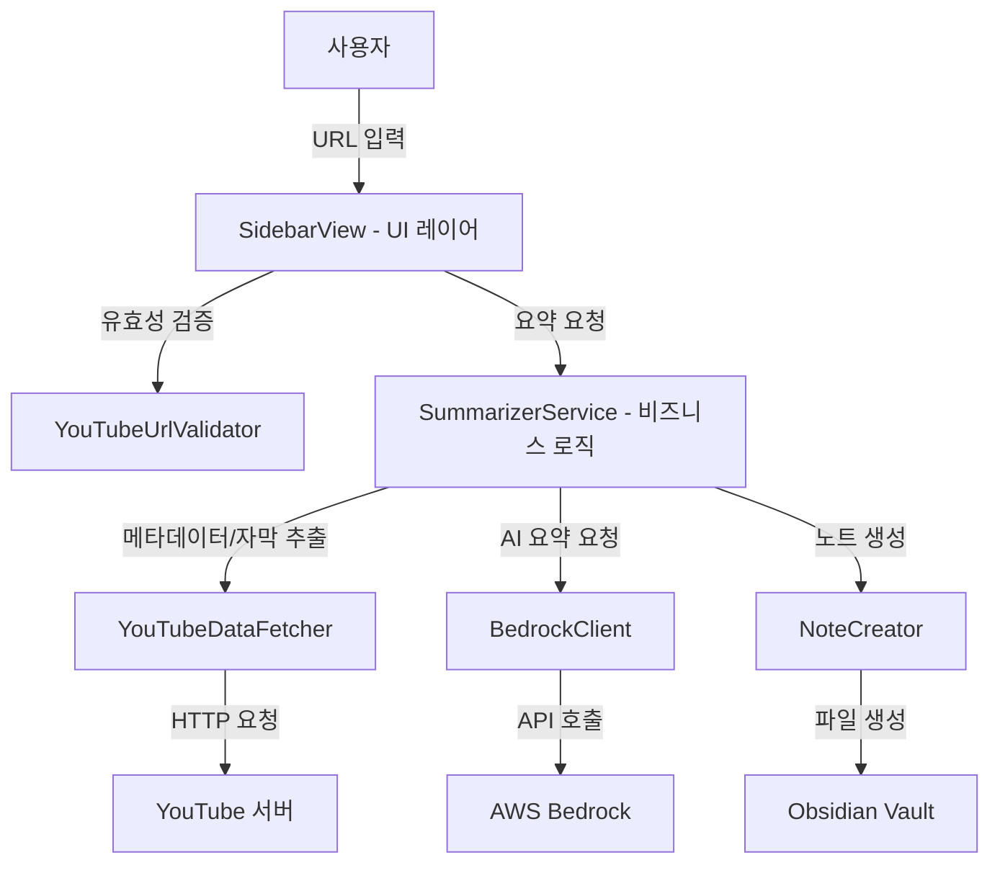

# 기술 설계 문서: Obsidian YouTube Summarizer

## 개요 (Overview)

이 플러그인은 옵시디언(Obsidian) 환경에서 유튜브 영상 링크를 입력받아, 영상 자막을 추출하고 AWS Bedrock(Claude)을 통해 AI 요약을 생성한 뒤, 영상 임베딩과 요약이 포함된 마크다운 노트를 자동 생성하는 기능을 제공한다.

핵심 흐름:
1. 사용자가 사이드바 패널에서 유튜브 URL 입력
2. URL 유효성 검증
3. 영상 메타데이터(제목, 설명) 및 자막 추출
4. AWS Bedrock API를 통한 AI 요약 생성
5. 마크다운 노트 생성 및 옵시디언에서 열기

자막이 없는 영상의 경우, 영상 제목과 설명을 기반으로 대체 요약을 생성한다.

## 아키텍처 (Architecture)

### 전체 구조

플러그인은 옵시디언 플러그인 API 위에 구축되며, 다음과 같은 레이어로 구성된다:



### 모듈 구성

```
src/
├── main.ts                    # 플러그인 진입점 (Plugin 클래스)
├── views/
│   └── SidebarView.ts         # 사이드바 패널 UI
├── services/
│   ├── SummarizerService.ts   # 요약 프로세스 오케스트레이션
│   ├── YouTubeDataFetcher.ts  # 유튜브 메타데이터/자막 추출
│   ├── BedrockClient.ts       # AWS Bedrock API 클라이언트
│   └── NoteCreator.ts         # 마크다운 노트 생성
├── utils/
│   └── YouTubeUrlValidator.ts # URL 유효성 검증 유틸리티
├── models/
│   └── types.ts               # 타입 정의
└── settings/
    └── SettingsTab.ts         # 플러그인 설정 탭
```

### 설계 결정 사항

1. **자막 추출 방식**: YouTube Data API 키 없이 동작하기 위해, 유튜브 페이지의 자막 데이터를 HTTP 요청으로 직접 파싱한다. `youtube-transcript` 같은 라이브러리 패턴을 참고하여 `timedtext` API 엔드포인트를 활용한다.

2. **메타데이터 추출**: 유튜브 영상 페이지의 HTML에서 `<meta>` 태그 또는 `ytInitialPlayerResponse` JSON을 파싱하여 제목과 설명을 추출한다. 별도 API 키가 필요 없다.

3. **AWS Bedrock 인증**: 옵시디언은 데스크톱 앱이므로, 사용자의 로컬 AWS 자격 증명(~/.aws/credentials 또는 환경 변수)을 활용한다. 플러그인 설정에서 AWS 리전과 모델 ID만 설정하면 된다.

4. **노트 생성 전략**: 옵시디언 Vault API(`app.vault.create`)를 사용하여 마크다운 파일을 생성한다. 동일 제목 중복 시 타임스탬프를 파일명에 추가한다.

## 컴포넌트 및 인터페이스 (Components and Interfaces)

### 1. YouTubeSummarizerPlugin (main.ts)

플러그인의 진입점으로, 옵시디언 `Plugin` 클래스를 상속한다.

```typescript
class YouTubeSummarizerPlugin extends Plugin {
  settings: PluginSettings;

  async onload(): Promise<void>;    // 플러그인 로드 시 사이드바 뷰 등록, 설정 탭 추가
  async onunload(): Promise<void>;  // 플러그인 언로드 시 정리
  async loadSettings(): Promise<void>;
  async saveSettings(): Promise<void>;
}
```

### 2. SidebarView (views/SidebarView.ts)

옵시디언 `ItemView`를 상속하여 사이드바 패널 UI를 구현한다.

```typescript
class SidebarView extends ItemView {
  // UI 요소
  private urlInput: HTMLInputElement;
  private summarizeButton: HTMLButtonElement;
  private statusMessage: HTMLElement;

  getViewType(): string;           // 뷰 타입 식별자 반환
  getDisplayText(): string;        // 사이드바 탭 표시 텍스트
  async onOpen(): Promise<void>;   // UI 렌더링
  async onClose(): Promise<void>;  // 정리

  // 상태 관리
  setLoading(loading: boolean, message?: string): void;  // 로딩 상태 전환
  showError(message: string): void;                       // 오류 메시지 표시
  showSuccess(message: string): void;                     // 성공 메시지 표시
  resetForm(): void;                                      // 폼 초기화
}
```

### 3. YouTubeUrlValidator (utils/YouTubeUrlValidator.ts)

유튜브 URL 유효성 검증 및 영상 ID 추출을 담당하는 순수 함수 모듈.

```typescript
// URL 유효성 검증 결과
interface ValidationResult {
  isValid: boolean;
  videoId: string | null;
  error: string | null;
}

function validateYouTubeUrl(url: string): ValidationResult;
function extractVideoId(url: string): string | null;
```

지원하는 URL 형식:
- `https://www.youtube.com/watch?v=VIDEO_ID`
- `https://youtu.be/VIDEO_ID`
- `https://www.youtube.com/shorts/VIDEO_ID`
- 위 형식들의 변형 (http, www 유무, 추가 쿼리 파라미터 등)

### 4. YouTubeDataFetcher (services/YouTubeDataFetcher.ts)

유튜브 영상의 메타데이터와 자막을 가져오는 서비스.

```typescript
interface VideoMetadata {
  title: string;
  description: string;
  videoId: string;
}

interface TranscriptResult {
  transcript: string | null;
  hasTranscript: boolean;
}

class YouTubeDataFetcher {
  async fetchMetadata(videoId: string): Promise<VideoMetadata>;
  async fetchTranscript(videoId: string): Promise<TranscriptResult>;
}
```

### 5. BedrockClient (services/BedrockClient.ts)

AWS Bedrock API와 통신하여 AI 요약을 생성하는 클라이언트.

```typescript
interface SummarizeRequest {
  transcript: string | null;  // 자막 텍스트 (없으면 null)
  metadata: {
    title: string;            // 영상 제목
    channel: string;          // 채널명
    duration: string;         // 영상 길이 (분)
    transcriptType: 'manual' | 'auto-generated' | 'none'; // 자막 유형
    language: string;         // 언어
    description: string;      // 영상 설명
  };
  prompt: string;             // 요약 프롬프트 (system_prompt.md 기반)
  isFallback: boolean;        // 대체 요약 여부
}

interface SummarizeResponse {
  summary: string;
  success: boolean;
  error?: string;
}

class BedrockClient {
  constructor(region: string, modelId: string);
  async summarize(request: SummarizeRequest): Promise<SummarizeResponse>;
}
```

### 6. NoteCreator (services/NoteCreator.ts)

마크다운 노트를 생성하고 옵시디언에서 여는 서비스.

```typescript
interface NoteContent {
  videoTitle: string;
  videoId: string;
  videoUrl: string;
  summary: string;
  isFallbackSummary: boolean;
}

class NoteCreator {
  constructor(app: App, savePath: string);
  async createNote(content: NoteContent): Promise<TFile>;
  generateMarkdown(content: NoteContent): string;
  async resolveFilePath(title: string): Promise<string>;
}
```

### 7. SummarizerService (services/SummarizerService.ts)

전체 요약 프로세스를 오케스트레이션하는 서비스.

```typescript
type ProgressCallback = (stage: string) => void;

class SummarizerService {
  constructor(
    fetcher: YouTubeDataFetcher,
    bedrockClient: BedrockClient,
    noteCreator: NoteCreator
  );

  async summarize(
    videoId: string,
    videoUrl: string,
    prompt: string,
    onProgress: ProgressCallback
  ): Promise<TFile>;
}
```

### 8. SettingsTab (settings/SettingsTab.ts)

플러그인 설정 UI를 제공하는 탭.

```typescript
class SettingsTab extends PluginSettingTab {
  async display(): Promise<void>;  // 설정 UI 렌더링
}
```

## 데이터 모델 (Data Models)

### PluginSettings

```typescript
interface PluginSettings {
  summaryPrompt: string;      // 요약 프롬프트 템플릿
  saveFolderPath: string;     // 노트 저장 폴더 경로
  awsRegion: string;          // AWS 리전
  bedrockModelId: string;     // Bedrock 모델 ID
}
```

기본값:
```typescript
const DEFAULT_SETTINGS: PluginSettings = {
  summaryPrompt: DEFAULT_SUMMARY_PROMPT, // system_prompt.md 내용을 상수로 내장
  saveFolderPath: "YouTube Summaries",
  awsRegion: "us-east-1",
  bedrockModelId: "anthropic.claude-3-sonnet-20240229-v1:0",
};
```

`DEFAULT_SUMMARY_PROMPT`는 `system_prompt.md`의 전체 내용을 문자열 상수로 포함한다. 이 프롬프트는 장르 자동 감지(NEWS, LECTURE, TECH, BUSINESS, FINANCE, OTHER), 장르별 요약 전략, 구조화된 출력 형식(한줄 요약, 핵심 내용, 핵심 인사이트, 키워드, 추가 탐색 주제)을 포함하며, 입력 형식에서 `{content}` 플레이스홀더 대신 아래 메타정보 블록을 사용한다:

```
[영상 메타정보]
- 제목: {title}
- 채널: {channel}
- 길이: {duration}분
- 자막 유형: {manual | auto-generated}
- 언어: {language}

[자막 원문]
{transcript_text}
```
```

### 요약 노트 마크다운 템플릿

```markdown
---
tags:
  - youtube-summary
  - {장르태그}
date: {YYYY-MM-DD}
url: https://www.youtube.com/watch?v={videoId}
channel: {채널명}
---

# {영상_제목}


---

> [!note] 이 요약은 자막이 아닌 영상 설명을 기반으로 생성되었습니다
<!-- 대체 요약인 경우에만 표시 -->

## 요약

{AI 생성 요약 내용}
```

- YAML 프론트매터로 태그, 생성 일자, 원본 링크, 채널명 등 속성을 포함한다
- `{장르태그}`는 AI가 감지한 장르(news, lecture, tech, business, finance, other)를 소문자로 변환하여 사용한다
- 옵시디언 네이티브 임베딩 문법 ``을 사용하여 별도 설정이나 플러그인 없이 유튜브 영상을 임베딩한다

### 진행 상태 단계

```typescript
enum SummaryStage {
  VALIDATING = "URL 검증 중...",
  FETCHING_METADATA = "메타데이터 가져오는 중...",
  FETCHING_TRANSCRIPT = "자막 가져오는 중...",
  SUMMARIZING = "AWS Bedrock 요약 생성 중...",
  CREATING_NOTE = "노트 생성 중...",
  COMPLETE = "요약이 완료되었습니다",
}
```


## 정확성 속성 (Correctness Properties)

*속성(Property)이란 시스템의 모든 유효한 실행에서 참이어야 하는 특성 또는 동작을 의미한다. 속성은 사람이 읽을 수 있는 명세와 기계가 검증할 수 있는 정확성 보장 사이의 다리 역할을 한다.*

### Property 1: 유효한 유튜브 URL은 videoId를 추출한다

*For any* 유효한 유튜브 URL(youtube.com/watch, youtu.be, youtube.com/shorts 형식과 그 변형), `validateYouTubeUrl` 함수는 `isValid: true`를 반환하고 올바른 11자리 videoId를 추출해야 한다.

**Validates: Requirements 2.1, 2.3**

### Property 2: 유효하지 않은 URL은 거부된다

*For any* 유효한 유튜브 URL 형식이 아닌 문자열, `validateYouTubeUrl` 함수는 `isValid: false`를 반환하고 `videoId`는 `null`이어야 한다.

**Validates: Requirements 2.2**

### Property 3: 대체 제목 생성

*For any* 영상 ID 문자열, 대체 제목 생성 함수는 해당 영상 ID를 포함하는 비어있지 않은 문자열을 반환해야 한다.

**Validates: Requirements 3.4**

### Property 4: 마크다운 노트 구조 무결성

*For any* 유효한 `NoteContent` 객체(videoTitle, videoId, summary 포함), `generateMarkdown` 함수의 출력은 반드시 (1) 영상 제목을 h1 헤더로 포함하고, (2) 해당 videoId가 포함된 옵시디언 네이티브 임베딩(``)을 포함하고, (3) 요약 내용을 포함해야 한다.

**Validates: Requirements 4.1, 4.2, 4.3, 5.3**

### Property 5: 대체 요약 안내 문구 포함

*For any* `isFallbackSummary`가 `true`인 `NoteContent` 객체, `generateMarkdown` 함수의 출력은 "이 요약은 자막이 아닌 영상 설명을 기반으로 생성되었습니다"라는 안내 문구를 포함해야 한다. 반대로 `isFallbackSummary`가 `false`이면 해당 문구가 포함되지 않아야 한다.

**Validates: Requirements 5.4**

### Property 6: 파일명 중복 해결

*For any* 영상 제목 문자열, 동일 제목의 파일이 이미 존재하는 경우 `resolveFilePath` 함수는 원본과 다른 고유한 파일 경로를 반환해야 하며, 해당 경로에는 타임스탬프가 포함되어야 한다.

**Validates: Requirements 4.5**

### Property 7: 프롬프트와 콘텐츠 결합

*For any* 요약 프롬프트 템플릿과 콘텐츠 문자열(자막 또는 메타데이터), Bedrock 요청 생성 시 프롬프트 내의 `{content}` 플레이스홀더가 실제 콘텐츠로 대체되어야 하며, 결과 문자열에 원본 콘텐츠가 포함되어야 한다.

**Validates: Requirements 5.1, 5.2**

### Property 8: 설정 저장/로드 라운드트립

*For any* 유효한 `PluginSettings` 객체, 설정을 저장한 후 다시 로드하면 원본과 동일한 설정 값을 반환해야 한다.

**Validates: Requirements 6.3**

### Property 9: 진행 콜백 순서 보장

*For any* 요약 프로세스 실행에서, `onProgress` 콜백은 반드시 정해진 순서(메타데이터 → 자막 → 요약 → 노트 생성)로 호출되어야 하며, 어떤 단계도 건너뛰지 않아야 한다.

**Validates: Requirements 8.2**

## 오류 처리 (Error Handling)

### 오류 유형 및 처리 전략

| 오류 상황 | 처리 방식 | 사용자 메시지 |
|-----------|----------|-------------|
| 빈 URL 입력 | 즉시 반환, 프로세스 시작하지 않음 | "유튜브 링크를 입력해주세요" |
| 유효하지 않은 URL | 즉시 반환, 프로세스 시작하지 않음 | "유효한 유튜브 링크를 입력해주세요" |
| 메타데이터 가져오기 실패 | 영상 ID 기반 대체 제목 사용, 프로세스 계속 | 별도 메시지 없음 (내부 처리) |
| 자막 가져오기 실패 | 영상 설명 기반 대체 요약으로 전환 | "자막을 가져올 수 없어 영상 설명 기반으로 요약합니다" |
| AWS Bedrock API 실패 | 영상 임베딩만 포함된 노트 생성 | "요약 생성에 실패했습니다. 다시 시도해주세요" |
| 노트 파일 생성 실패 | 옵시디언 알림으로 오류 표시 | "노트 생성에 실패했습니다" |
| 네트워크 오류 | 타임아웃 후 오류 메시지 표시 | "네트워크 오류가 발생했습니다. 인터넷 연결을 확인해주세요" |

### 오류 처리 원칙

1. **그레이스풀 디그레이데이션(Graceful Degradation)**: 자막 실패 시 메타데이터 기반 대체 요약, AI 실패 시 임베딩만 포함된 노트 생성 등 가능한 한 부분적 결과라도 제공한다.
2. **사용자 친화적 메시지**: 기술적 오류 세부사항 대신 사용자가 이해할 수 있는 한국어 메시지를 표시한다.
3. **상태 복원**: 오류 발생 시 요약 버튼을 다시 활성화하고 입력 필드를 유지하여 재시도가 가능하도록 한다.
4. **로깅**: `console.error`를 통해 개발자 디버깅용 상세 오류 정보를 기록한다.

## 테스트 전략 (Testing Strategy)

### 이중 테스트 접근법

이 플러그인은 단위 테스트(unit test)와 속성 기반 테스트(property-based test)를 병행하여 포괄적인 테스트 커버리지를 확보한다.

### 속성 기반 테스트 (Property-Based Testing)

- **라이브러리**: `fast-check` (TypeScript/JavaScript용 PBT 라이브러리)
- **최소 반복 횟수**: 각 속성 테스트당 100회 이상
- **태그 형식**: `Feature: obsidian-youtube-summarizer, Property {번호}: {속성 설명}`

각 정확성 속성(Property 1~9)은 하나의 속성 기반 테스트로 구현한다:

1. **Property 1 테스트**: 랜덤 videoId와 URL 형식 조합을 생성하여 유효한 URL이 올바르게 파싱되는지 검증
2. **Property 2 테스트**: 랜덤 문자열을 생성하여 유효하지 않은 URL이 거부되는지 검증
3. **Property 3 테스트**: 랜덤 영상 ID 문자열로 대체 제목 생성 로직 검증
4. **Property 4 테스트**: 랜덤 NoteContent 객체로 마크다운 구조 무결성 검증
5. **Property 5 테스트**: 랜덤 NoteContent(isFallback true/false)로 안내 문구 조건부 포함 검증
6. **Property 6 테스트**: 랜덤 제목 문자열로 파일명 중복 해결 로직 검증
7. **Property 7 테스트**: 랜덤 프롬프트/콘텐츠 조합으로 플레이스홀더 대체 검증
8. **Property 8 테스트**: 랜덤 PluginSettings 객체로 저장/로드 라운드트립 검증
9. **Property 9 테스트**: 다양한 시나리오(자막 성공/실패)에서 진행 콜백 순서 검증

### 단위 테스트 (Unit Testing)

단위 테스트는 특정 예제, 에지 케이스, 오류 조건에 집중한다:

- **URL 검증 에지 케이스**: 빈 문자열, 공백만 있는 문자열, 유사하지만 유효하지 않은 URL
- **메타데이터 파싱**: 실제 유튜브 HTML 응답 샘플을 사용한 파싱 테스트
- **오류 처리 경로**: AWS Bedrock 실패, 네트워크 타임아웃 등 각 오류 시나리오
- **기본 설정값**: DEFAULT_SETTINGS의 각 필드가 요구사항과 일치하는지 확인
- **노트 생성**: 특정 입력에 대한 마크다운 출력 스냅샷 테스트

### 테스트 프레임워크

- **테스트 러너**: Vitest (TypeScript 네이티브 지원, 빠른 실행)
- **속성 기반 테스트**: fast-check
- **모킹**: Vitest 내장 모킹 기능 (`vi.mock`, `vi.fn`)
