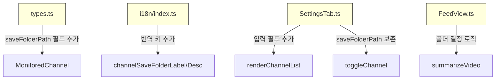

# 기술 설계 문서: 채널별 저장 폴더

## 개요 (Overview)

기존 Obsidian YouTube Summarizer 플러그인의 구독 피드 기능을 확장하여, 채널별로 개별 저장 폴더를 설정할 수 있도록 한다. 현재 모든 구독 채널의 요약 노트는 하나의 공통 폴더(`subscriptionSaveFolderPath`)에 저장되지만, 이 기능을 통해 사용자가 채널마다 다른 폴더에 요약 노트를 정리할 수 있게 된다.

핵심 흐름:
1. `MonitoredChannel` 타입에 선택적 `saveFolderPath` 필드 추가
2. 설정 탭에서 모니터링 중인 채널마다 저장 폴더 경로 입력 필드 표시
3. 영상 요약 시 채널별 폴더가 설정되어 있으면 해당 폴더에, 없으면 기존 공통 폴더에 저장
4. 기존 `subscriptionSaveFolderPath`는 fallback으로 유지하여 하위 호환성 보장

### 설계 결정 사항

1. **최소 변경 원칙**: `NoteCreator.createNoteWithDatePrefix()`는 이미 `saveFolderPath`를 세 번째 인자로 받으므로 변경 불필요. `FeedView.summarizeVideo()`에서 채널별 폴더 결정 로직만 추가하면 된다.

2. **Fallback 전략**: `MonitoredChannel.saveFolderPath`가 `undefined`이거나 빈 문자열(`""`)이면 기존 `subscriptionSaveFolderPath`를 사용한다. 이를 통해 기존 사용자의 설정이 그대로 동작한다.

3. **하위 호환성**: `saveFolderPath`는 optional 필드이므로, 기존에 저장된 `MonitoredChannel` 데이터(필드 없음)를 `Object.assign`/스프레드로 로드해도 `undefined`로 처리되어 정상 동작한다.

4. **UI 배치**: 채널별 저장 폴더 입력 필드는 해당 채널의 토글 아래에 표시한다. 모니터링이 해제된 채널에는 입력 필드를 표시하지 않는다. placeholder로 공통 저장 폴더 경로를 표시하여 사용자가 기본값을 인지할 수 있게 한다.

5. **채널 토글 시 saveFolderPath 보존**: 채널을 해제했다가 다시 체크할 때, 이전에 설정한 `saveFolderPath`가 유실되지 않도록 기존 `MonitoredChannel` 데이터를 보존한다.

## 아키텍처 (Architecture)

### 변경 범위



### 변경 대상 파일

| 파일 | 변경 내용 | 변경 규모 |
|------|----------|----------|
| `src/models/types.ts` | `MonitoredChannel`에 `saveFolderPath?` 추가 | 1줄 |
| `src/i18n/index.ts` | 번역 키 2개 추가 (en/ko) | ~10줄 |
| `src/settings/SettingsTab.ts` | `renderChannelList`에 입력 필드, `toggleChannel`에 보존 로직 | ~30줄 |
| `src/views/FeedView.ts` | `summarizeVideo`에서 채널별 폴더 결정 | ~10줄 |

### 변경하지 않는 파일

- `src/services/NoteCreator.ts`: 이미 `saveFolderPath`를 인자로 받음
- `src/main.ts`: `FeedView`가 settings를 통해 채널별 폴더를 결정
- `src/services/SubscriptionManager.ts`: 저장 폴더와 무관

## 컴포넌트 및 인터페이스 (Components and Interfaces)

### 1. MonitoredChannel 타입 확장 (types.ts)

```typescript
interface MonitoredChannel {
  channelId: string;
  channelTitle: string;
  thumbnailUrl: string;
  saveFolderPath?: string;  // 신규: 채널별 저장 폴더 경로 (optional)
}
```

### 2. i18n 키 추가 (i18n/index.ts)

`Translations` 인터페이스에 추가:

```typescript
interface Translations {
  // ... 기존 키 유지
  channelSaveFolderLabel: string;   // 신규
  channelSaveFolderDesc: string;    // 신규
}
```

### 3. SettingsTab 변경 (settings/SettingsTab.ts)

`renderChannelList()` 메서드에서 모니터링 중인 채널에 저장 폴더 입력 필드를 추가:

```typescript
// 채널 토글 아래에 저장 폴더 입력 필드 표시
private renderChannelList(containerEl, tr): void {
  for (const channel of this.subscriptionChannels) {
    // 기존 토글 UI
    new Setting(containerEl).setName(channel.title).addToggle(...);

    // 모니터링 중인 채널이면 저장 폴더 입력 필드 표시
    if (isMonitored) {
      new Setting(containerEl)
        .setName(tr.channelSaveFolderLabel)
        .setDesc(tr.channelSaveFolderDesc)
        .addText((text) => {
          text
            .setPlaceholder(this.plugin.settings.subscriptionSaveFolderPath)
            .setValue(existingChannel?.saveFolderPath ?? "")
            .onChange(async (value) => {
              // monitoredChannels에서 해당 채널의 saveFolderPath 업데이트
            });
        });
    }
  }
}
```

`toggleChannel()` 메서드에서 기존 `saveFolderPath` 보존:

```typescript
private async toggleChannel(channel, enabled): Promise<void> {
  if (enabled) {
    // 기존에 저장된 saveFolderPath가 있으면 보존
    const existing = channels.find(ch => ch.channelId === channel.channelId);
    if (!existing) {
      channels.push({
        channelId: channel.channelId,
        channelTitle: channel.title,
        thumbnailUrl: channel.thumbnailUrl,
        // saveFolderPath는 undefined로 시작 (기본값 사용)
      });
    }
  }
  // ... 기존 제거 로직 유지
}
```

### 4. FeedView 변경 (views/FeedView.ts)

`summarizeVideo()` 메서드에서 채널별 저장 폴더 결정 로직 추가:

```typescript
async summarizeVideo(video: VideoItem): Promise<void> {
  const settings = this.deps.getSettings();

  // 채널별 저장 폴더 결정: 채널 설정 → 공통 폴더 fallback
  const monitoredChannel = settings.monitoredChannels.find(
    ch => ch.channelId === video.channelId
  );
  const saveFolderPath = 
    monitoredChannel?.saveFolderPath?.trim() || settings.subscriptionSaveFolderPath;

  // NoteCreator에 결정된 폴더 경로 전달
  const noteCreator = new NoteCreator(this.deps.app, saveFolderPath);
  await noteCreator.createNoteWithDatePrefix(noteContent, video.publishedAt, saveFolderPath);
}
```

### 5. 채널별 저장 폴더 결정 로직 (순수 함수)

테스트 용이성을 위해 폴더 결정 로직을 순수 함수로 추출:

```typescript
/**
 * 채널별 저장 폴더 경로를 결정하는 순수 함수
 * @param monitoredChannels - 모니터링 대상 채널 목록
 * @param channelId - 대상 채널 ID
 * @param defaultFolderPath - 기본 저장 폴더 경로
 * @returns 결정된 저장 폴더 경로
 */
export function resolveChannelSaveFolderPath(
  monitoredChannels: MonitoredChannel[],
  channelId: string,
  defaultFolderPath: string
): string {
  const channel = monitoredChannels.find(ch => ch.channelId === channelId);
  const channelPath = channel?.saveFolderPath?.trim();
  return channelPath && channelPath.length > 0 ? channelPath : defaultFolderPath;
}
```

## 데이터 모델 (Data Models)

### MonitoredChannel (확장)

```typescript
interface MonitoredChannel {
  channelId: string;       // YouTube 채널 ID
  channelTitle: string;    // 채널 이름
  thumbnailUrl: string;    // 채널 썸네일 URL
  saveFolderPath?: string; // 신규: 채널별 저장 폴더 경로 (optional)
}
```

- `saveFolderPath`가 `undefined` 또는 `""` → `subscriptionSaveFolderPath` 사용
- `saveFolderPath`가 유효한 문자열 → 해당 경로 사용

### PluginSettings (변경 없음)

기존 `subscriptionSaveFolderPath`는 그대로 유지. 채널별 폴더가 설정되지 않은 경우의 fallback으로 사용.

### i18n 키 추가

| 키 | en | ko |
|----|----|----|
| `channelSaveFolderLabel` | `"Channel Save Folder"` | `"채널별 저장 폴더"` |
| `channelSaveFolderDesc` | `"Folder path for this channel's summary notes (leave empty to use default)"` | `"이 채널의 요약 노트 저장 폴더 경로 (비워두면 기본 폴더 사용)"` |

## 정확성 속성 (Correctness Properties)

*속성(Property)이란 시스템의 모든 유효한 실행에서 참이어야 하는 특성 또는 동작을 의미한다. 속성은 사람이 읽을 수 있는 명세와 기계가 검증할 수 있는 정확성 보장 사이의 다리 역할을 한다.*

### Property 1: 채널별 저장 폴더 결정 로직

*For any* `MonitoredChannel` 목록, 채널 ID, 기본 폴더 경로에 대해:
- 해당 채널의 `saveFolderPath`가 유효한 비공백 문자열이면 `resolveChannelSaveFolderPath`는 해당 경로를 반환해야 한다
- 해당 채널의 `saveFolderPath`가 `undefined`, 빈 문자열, 또는 공백만으로 구성된 문자열이면 기본 폴더 경로를 반환해야 한다
- 해당 채널 ID가 목록에 없으면 기본 폴더 경로를 반환해야 한다

**Validates: Requirements 1.2, 3.1, 3.2, 5.3**

### Property 2: 하위 호환성 - 기존 데이터 로드

*For any* `saveFolderPath` 필드가 없는 `MonitoredChannel` 객체에 대해, `resolveChannelSaveFolderPath`에 전달하면 오류 없이 기본 폴더 경로를 반환해야 한다. 즉, `saveFolderPath`가 `undefined`인 기존 데이터는 항상 fallback 경로를 사용한다.

**Validates: Requirements 1.1, 1.3, 5.2**

### Property 3: 채널 설정 라운드트립

*For any* `saveFolderPath`가 설정된 `MonitoredChannel` 배열에 대해, 해당 배열을 `PluginSettings.monitoredChannels`에 저장한 후 다시 로드하면 각 채널의 `saveFolderPath` 값이 원본과 동일해야 한다.

**Validates: Requirements 2.5**

### Property 4: 번역 키 완전성

*For any* 채널별 저장 폴더 관련 i18n 키(`channelSaveFolderLabel`, `channelSaveFolderDesc`)에 대해, 영어(en)와 한국어(ko) 번역 객체 모두에 해당 키가 존재하고 비어있지 않은 문자열 값을 가져야 한다.

**Validates: Requirements 4.1**

## 오류 처리 (Error Handling)

### 오류 유형 및 처리 전략

| 오류 상황 | 처리 방식 |
|-----------|----------|
| `saveFolderPath`가 `undefined` 또는 빈 문자열 | `subscriptionSaveFolderPath` fallback 사용 |
| `saveFolderPath`가 공백만으로 구성 | `trim()` 후 빈 문자열로 판단, fallback 사용 |
| 채널별 저장 폴더가 존재하지 않음 | `NoteCreator.createNoteWithDatePrefix`가 자동 생성 (기존 로직) |
| 기존 데이터에 `saveFolderPath` 필드 없음 | `undefined`로 처리, fallback 사용 |

### 오류 처리 원칙

1. **안전한 기본값**: `saveFolderPath`가 유효하지 않으면 항상 공통 폴더로 fallback
2. **기존 동작 보존**: 새 필드 추가로 인해 기존 오류 처리 흐름이 변경되지 않음
3. **폴더 자동 생성**: `NoteCreator`의 기존 폴더 생성 로직을 그대로 활용

## 테스트 전략 (Testing Strategy)

### 이중 테스트 접근법

이 기능은 단위 테스트(unit test)와 속성 기반 테스트(property-based test)를 병행하여 포괄적인 테스트 커버리지를 확보한다.

### 속성 기반 테스트 (Property-Based Testing)

- **라이브러리**: `fast-check` (기존 프로젝트에서 이미 사용 중)
- **최소 반복 횟수**: 각 속성 테스트당 100회 이상
- **태그 형식**: `Feature: per-channel-save-folder, Property {번호}: {속성 설명}`

각 정확성 속성은 하나의 속성 기반 테스트로 구현한다:

1. **Property 1 테스트**: 랜덤 `MonitoredChannel` 목록(saveFolderPath 유/무/빈 문자열/공백), 랜덤 channelId, 랜덤 기본 폴더 경로로 `resolveChannelSaveFolderPath` 결과 검증
2. **Property 2 테스트**: `saveFolderPath` 필드가 없는 랜덤 `MonitoredChannel` 객체로 fallback 동작 검증
3. **Property 3 테스트**: 랜덤 `saveFolderPath`가 설정된 `MonitoredChannel` 배열의 `Object.assign` 라운드트립 검증
4. **Property 4 테스트**: 채널별 저장 폴더 관련 i18n 키에 대해 en/ko 번역 존재 및 비어있지 않은 문자열 검증

### 단위 테스트 (Unit Testing)

단위 테스트는 특정 예제, 에지 케이스, UI 동작에 집중한다:

- **SettingsTab**: 모니터링 중인 채널에 저장 폴더 입력 필드 표시/숨김, placeholder 값, 입력값 저장
- **FeedView**: `summarizeVideo`에서 채널별 폴더 사용, fallback 동작
- **toggleChannel**: 채널 재활성화 시 `saveFolderPath` 보존

### 테스트 프레임워크

- **테스트 러너**: Vitest (기존 프로젝트 설정 유지)
- **속성 기반 테스트**: fast-check (기존 devDependency)
- **모킹**: Vitest 내장 모킹 기능 (`vi.mock`, `vi.fn`)
- **DOM 테스트**: jsdom (기존 devDependency)

### 하위 호환성 검증

- 기존 185개 테스트가 모두 통과해야 한다
- `MonitoredChannel`에 `saveFolderPath` 필드를 추가해도 기존 테스트에서 해당 필드를 사용하지 않으므로 영향 없음

