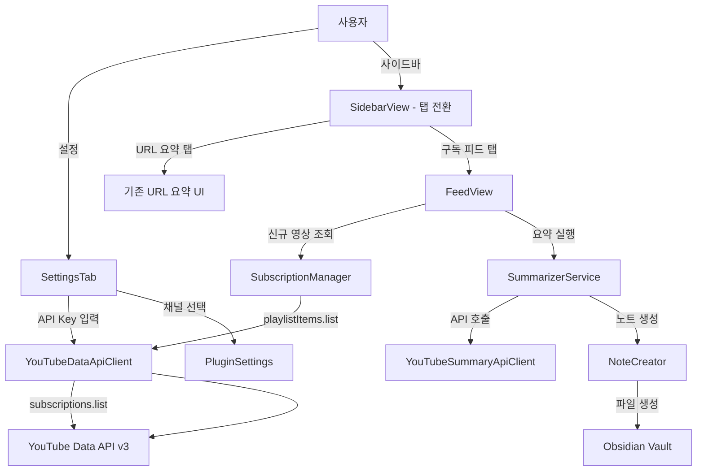

# 기술 설계 문서: YouTube 구독 피드

## 개요 (Overview)

기존 Obsidian YouTube Summarizer 플러그인을 확장하여, YouTube Data API v3를 통해 사용자의 구독 채널 목록을 조회하고, 선택한 채널의 신규 영상을 감지하여 사이드바에서 확인 및 개별 요약할 수 있는 기능을 추가한다.

핵심 흐름:
1. 설정 탭에서 YouTube Data API Key 입력 및 구독 채널 목록 조회
2. 모니터링할 채널을 체크박스로 선택
3. 사이드바의 구독 피드 탭에서 신규 영상 목록 확인
4. 영상별 "요약하기" 버튼으로 기존 SummarizerService를 통해 요약 노트 생성
5. 요약 노트는 `yyyy-MM-dd_영상제목.md` 형식으로 전용 폴더에 저장

기존 URL 입력 요약 기능은 그대로 유지하며, 사이드바 탭 전환 UI를 통해 두 기능을 전환한다.

### 설계 결정 사항

1. **YouTube Data API 엔드포인트 선택**: 신규 영상 조회에 `playlistItems.list`를 사용한다. 각 채널의 "Uploads" 플레이리스트 ID는 채널 ID의 두 번째 문자를 `U`로 교체하여 도출한다 (예: `UCxxxx` → `UUxxxx`). `search.list`는 쿼터 비용이 100인 반면 `playlistItems.list`는 1이므로 쿼터 효율이 100배 높다.

2. **HTTP 클라이언트**: 기존 플러그인과 동일하게 옵시디언의 `requestUrl` API를 사용한다. CORS 제약 없이 외부 API를 호출할 수 있으며 모바일에서도 동작한다.

3. **페이지네이션**: YouTube Data API의 `subscriptions.list`는 한 번에 최대 50개를 반환한다. `nextPageToken`을 사용하여 모든 구독 채널을 순차적으로 조회한다.

4. **신규 영상 판별**: 각 채널별 마지막 확인 시점(`lastCheckedAt`)을 저장하고, `playlistItems.list` 응답의 `publishedAt`과 비교하여 신규 영상을 판별한다.

5. **파일명 형식**: `yyyy-MM-dd_영상제목.md` 형식을 사용한다. 업로드 날짜를 접두사로 붙여 시간순 정렬이 가능하도록 한다. 파일명 특수문자는 기존 `sanitizeFileName` 함수를 재사용하여 제거한다.

6. **탭 전환 UI**: 기존 `SidebarView`에 탭 컨테이너를 추가하여 "URL 요약" 탭과 "구독 피드" 탭을 전환한다. 마지막 선택 탭 상태는 메모리에서 유지하며, 뷰를 다시 열 때 복원한다.

7. **기존 서비스 재사용**: 요약 실행은 기존 `SummarizerService`를 그대로 사용한다. `NoteCreator`는 구독 전용 폴더 경로와 날짜 접두사 파일명을 지원하도록 확장한다.

## 아키텍처 (Architecture)

### 전체 구조



### 모듈 구성

```
src/
├── main.ts                              # 플러그인 진입점 (확장)
├── views/
│   ├── SidebarView.ts                   # 사이드바 뷰 (탭 전환 추가)
│   └── FeedView.ts                      # 신규: 구독 피드 뷰 컴포넌트
├── services/
│   ├── SummarizerService.ts             # 기존 요약 오케스트레이션 (변경 없음)
│   ├── YouTubeSummaryApiClient.ts       # 기존 요약 API 클라이언트 (변경 없음)
│   ├── YouTubeDataApiClient.ts          # 신규: YouTube Data API v3 클라이언트
│   ├── SubscriptionManager.ts           # 신규: 구독 관리 및 신규 영상 감지
│   └── NoteCreator.ts                   # 노트 생성 (날짜 접두사 파일명 지원 확장)
├── utils/
│   └── YouTubeUrlValidator.ts           # URL 유효성 검증 (변경 없음)
├── models/
│   └── types.ts                         # 타입 정의 (구독 관련 타입 추가)
├── settings/
│   └── SettingsTab.ts                   # 설정 탭 (YouTube Data API 섹션 추가)
└── i18n/
    └── index.ts                         # 다국어 지원 (구독 피드 키 추가)
```

## 컴포넌트 및 인터페이스 (Components and Interfaces)

### 1. YouTubeDataApiClient (신규: services/YouTubeDataApiClient.ts)

YouTube Data API v3와의 HTTP 통신을 담당하는 클라이언트.

```typescript
class YouTubeDataApiClient {
  constructor(apiKey: string, requestFn?: RequestFn);

  // 구독 채널 목록 조회 (페이지네이션 지원)
  async fetchSubscriptions(pageToken?: string): Promise<SubscriptionListResponse>;

  // 모든 구독 채널 조회 (자동 페이지네이션)
  async fetchAllSubscriptions(): Promise<SubscriptionChannel[]>;

  // 채널의 최근 영상 목록 조회
  async fetchRecentVideos(uploadsPlaylistId: string, maxResults?: number): Promise<PlaylistItemsResponse>;
}
```

`requestFn`은 테스트 시 `requestUrl`을 모킹하기 위한 선택적 의존성 주입 파라미터이다. 기존 `YouTubeSummaryApiClient`와 동일한 패턴을 따른다.

### 2. SubscriptionManager (신규: services/SubscriptionManager.ts)

구독 채널 관리 및 신규 영상 감지를 담당하는 서비스.

```typescript
class SubscriptionManager {
  constructor(apiClient: YouTubeDataApiClient, settings: PluginSettings);

  // 모니터링 대상 채널의 신규 영상 조회
  async fetchNewVideos(): Promise<ChannelVideos[]>;

  // 채널 ID로부터 Uploads 플레이리스트 ID 도출
  getUploadsPlaylistId(channelId: string): string;

  // 특정 채널의 마지막 확인 시점 이후 영상 필터링
  filterNewVideos(videos: VideoItem[], lastCheckedAt: string): VideoItem[];

  // 마지막 확인 시점 업데이트
  updateLastCheckedAt(channelId: string, timestamp: string): void;
}
```

### 3. FeedView (신규: views/FeedView.ts)

사이드바에서 신규 영상 목록과 요약 버튼을 표시하는 뷰 컴포넌트.

```typescript
class FeedView {
  constructor(containerEl: HTMLElement, deps: FeedViewDependencies);

  // 피드 UI 렌더링
  render(): void;

  // 신규 영상 목록 로드 및 표시
  async loadFeed(): Promise<void>;

  // 개별 영상 요약 실행
  async summarizeVideo(video: VideoItem): Promise<void>;

  // UI 정리
  destroy(): void;
}

interface FeedViewDependencies {
  subscriptionManager: SubscriptionManager;
  summarizerServiceFactory: () => SummarizerService;
  getSettings: () => PluginSettings;
  app: App;
}
```

### 4. SidebarView (수정: views/SidebarView.ts)

기존 URL 요약 UI에 탭 전환 기능을 추가한다.

```typescript
class SidebarView extends ItemView {
  // 기존 필드 유지
  private activeTab: "url" | "feed";

  async onOpen(): Promise<void>;  // 탭 UI 추가 렌더링
  
  // 탭 전환
  private switchTab(tab: "url" | "feed"): void;
  
  // URL 요약 탭 렌더링
  private renderUrlTab(container: HTMLElement): void;
  
  // 구독 피드 탭 렌더링 (FeedView에 위임)
  private renderFeedTab(container: HTMLElement): void;
}
```

### 5. SettingsTab (수정: settings/SettingsTab.ts)

YouTube Data API Key 입력, 구독 목록 가져오기 버튼, 채널 체크박스, 구독 전용 저장 폴더 설정을 추가한다.

```typescript
class SettingsTab extends PluginSettingTab {
  display(): void;  // 기존 설정 + 구독 피드 섹션 추가

  // 구독 채널 목록 UI 렌더링
  private renderSubscriptionSection(containerEl: HTMLElement): void;

  // 구독 목록 가져오기 실행
  private async fetchSubscriptions(): Promise<void>;

  // 채널 체크박스 토글 핸들러
  private async toggleChannel(channel: SubscriptionChannel, enabled: boolean): Promise<void>;
}
```

### 6. NoteCreator (수정: services/NoteCreator.ts)

구독 영상 요약 시 날짜 접두사 파일명을 지원하도록 확장한다.

```typescript
class NoteCreator {
  // 기존 메서드 유지

  // 날짜 접두사 파일명으로 노트 생성
  async createNoteWithDatePrefix(
    content: NoteContent,
    uploadDate: string,  // ISO 8601 형식
    saveFolderPath: string
  ): Promise<TFile>;

  // 날짜 접두사 파일 경로 결정
  resolveFilePathWithDatePrefix(title: string, uploadDate: string): string;
}
```

### 7. main.ts (수정)

`YouTubeDataApiClient`, `SubscriptionManager` 인스턴스를 생성하고 `SidebarView`에 주입한다.

```typescript
class YouTubeSummarizerPlugin extends Plugin {
  // 기존 필드 유지

  async onload(): Promise<void> {
    // 기존 로직 유지
    // + YouTubeDataApiClient, SubscriptionManager 생성
    // + SidebarView에 구독 관련 의존성 주입
  }
}
```

## 데이터 모델 (Data Models)

### PluginSettings (확장)

```typescript
interface PluginSettings {
  // 기존 필드
  language: Language;
  saveFolderPath: string;
  apiKey: string;

  // 신규 필드
  youtubeDataApiKey: string;                    // YouTube Data API Key
  monitoredChannels: MonitoredChannel[];         // 모니터링 대상 채널 목록
  subscriptionSaveFolderPath: string;            // 구독 영상 요약 저장 폴더
  lastCheckedAt: Record<string, string>;         // 채널별 마지막 확인 시점 (channelId → ISO 8601)
}
```

### MonitoredChannel (신규)

```typescript
interface MonitoredChannel {
  channelId: string;       // YouTube 채널 ID (예: "UCxxxx")
  channelTitle: string;    // 채널 이름
  thumbnailUrl: string;    // 채널 썸네일 URL
}
```

### SubscriptionChannel (신규)

YouTube Data API `subscriptions.list` 응답에서 추출한 채널 정보.

```typescript
interface SubscriptionChannel {
  channelId: string;
  title: string;
  thumbnailUrl: string;
  description: string;
}
```

### SubscriptionListResponse (신규)

```typescript
interface SubscriptionListResponse {
  items: SubscriptionChannel[];
  nextPageToken: string | null;
  totalResults: number;
}
```

### VideoItem (신규)

채널의 최근 영상 정보.

```typescript
interface VideoItem {
  videoId: string;
  title: string;
  channelId: string;
  channelTitle: string;
  publishedAt: string;      // ISO 8601 형식
  thumbnailUrl: string;
}
```

### PlaylistItemsResponse (신규)

```typescript
interface PlaylistItemsResponse {
  items: VideoItem[];
  nextPageToken: string | null;
}
```

### ChannelVideos (신규)

채널별 신규 영상 그룹.

```typescript
interface ChannelVideos {
  channelId: string;
  channelTitle: string;
  videos: VideoItem[];
}
```

### VideoSummaryStatus (신규)

피드 뷰에서 영상별 요약 상태를 추적하기 위한 타입.

```typescript
type VideoSummaryStatus = "idle" | "summarizing" | "completed" | "error";
```

### DEFAULT_SETTINGS (확장)

```typescript
const DEFAULT_SETTINGS: PluginSettings = {
  // 기존
  language: "en",
  saveFolderPath: "YouTube Summaries",
  apiKey: "",

  // 신규
  youtubeDataApiKey: "",
  monitoredChannels: [],
  subscriptionSaveFolderPath: "YouTube Subscriptions",
  lastCheckedAt: {},
};
```

### i18n 키 추가

기존 `Translations` 인터페이스에 다음 키를 추가한다:

```typescript
interface Translations {
  // 기존 키 유지...

  // 구독 피드 설정
  youtubeDataApiKeyLabel: string;
  youtubeDataApiKeyDesc: string;
  fetchSubscriptionsButton: string;
  fetchingSubscriptions: string;
  subscriptionChannelsLabel: string;
  subscriptionSaveFolderLabel: string;
  subscriptionSaveFolderDesc: string;
  subscriptionSectionHeader: string;

  // 사이드바 탭
  tabUrlSummary: string;
  tabSubscriptionFeed: string;

  // 피드 뷰
  feedRefreshButton: string;
  feedLoading: string;
  feedEmpty: string;
  feedNoChannels: string;
  feedSummarizeButton: string;
  feedSummarizing: string;
  feedSummarized: string;
  feedSummaryError: string;

  // 오류 메시지
  errorInvalidYoutubeDataApiKey: string;
  errorNetworkConnection: string;
  errorFetchSubscriptions: string;
}
```


## 정확성 속성 (Correctness Properties)

*속성(Property)이란 시스템의 모든 유효한 실행에서 참이어야 하는 특성 또는 동작을 의미한다. 속성은 사람이 읽을 수 있는 명세와 기계가 검증할 수 있는 정확성 보장 사이의 다리 역할을 한다.*

### Property 1: 설정 라운드트립

*For any* 유효한 `PluginSettings` 객체(youtubeDataApiKey, monitoredChannels, subscriptionSaveFolderPath, lastCheckedAt 포함), 설정을 저장한 후 다시 로드하면 원본과 동일한 설정 값을 반환해야 한다.

**Validates: Requirements 1.2, 3.2, 4.2, 5.3**

### Property 2: 페이지네이션 완전성

*For any* 구독 채널 수 N(N > 0)과 페이지 크기 50에 대해, `fetchAllSubscriptions`는 정확히 N개의 채널을 반환해야 하며, 반환된 채널 목록에 중복이 없어야 한다.

**Validates: Requirements 2.3**

### Property 3: 채널 토글 반영

*For any* 구독 채널과 토글 상태(true/false)에 대해, 채널 체크박스를 토글하면 `monitoredChannels` 배열에 해당 채널이 포함되거나 제거되어야 하며, 다른 채널의 모니터링 상태는 변경되지 않아야 한다.

**Validates: Requirements 3.1**

### Property 4: 신규 영상 필터링

*For any* 영상 목록과 마지막 확인 시점(ISO 8601 문자열)에 대해, `filterNewVideos`가 반환하는 모든 영상의 `publishedAt`은 마지막 확인 시점보다 이후여야 하며, 원본 목록에서 마지막 확인 시점 이후인 영상은 모두 결과에 포함되어야 한다.

**Validates: Requirements 5.2**

### Property 5: 채널별 영상 그룹화

*For any* 영상 목록에 대해, 채널별 그룹화 결과의 각 그룹 내 모든 영상은 동일한 `channelId`를 가져야 하며, 그룹화 전후의 총 영상 수가 동일해야 한다.

**Validates: Requirements 6.1**

### Property 6: 영상 항목 렌더링 정보 포함

*For any* 유효한 `VideoItem` 객체에 대해, 영상 항목 렌더링 결과는 영상 제목, 채널 이름, 업로드 날짜 텍스트를 모두 포함해야 한다.

**Validates: Requirements 6.2**

### Property 7: 날짜 접두사 파일명 형식

*For any* 유효한 영상 제목과 ISO 8601 형식의 업로드 날짜에 대해, `resolveFilePathWithDatePrefix`가 반환하는 파일명은 `yyyy-MM-dd_` 접두사로 시작해야 하며, 파일명에 사용할 수 없는 특수 문자(`\ / : * ? " < > |`)를 포함하지 않아야 한다.

**Validates: Requirements 6.4**

### Property 8: 번역 키 완전성

*For any* 구독 피드 관련 i18n 키에 대해, 영어(en)와 한국어(ko) 번역 객체 모두에 해당 키가 존재하고 비어있지 않은 문자열 값을 가져야 한다.

**Validates: Requirements 8.1**

### Property 9: Uploads 플레이리스트 ID 도출

*For any* "UC"로 시작하는 유효한 YouTube 채널 ID에 대해, `getUploadsPlaylistId`는 "UU"로 시작하고 나머지 부분이 원본 채널 ID와 동일한 문자열을 반환해야 한다.

**Validates: Requirements 5.1**

## 오류 처리 (Error Handling)

### 오류 유형 및 처리 전략

| 오류 상황 | 처리 방식 | 사용자 메시지 |
|-----------|----------|-------------|
| YouTube Data API Key 미입력 | 구독 관련 설정 섹션 비활성화 | 설정 섹션 비활성화 표시 |
| YouTube Data API Key 유효하지 않음 (403) | 오류 메시지 표시, 구독 목록 조회 중단 | "API Key가 유효하지 않습니다" |
| 네트워크 오류 (구독 목록 조회) | 오류 메시지 표시, 재시도 가능 | "네트워크 연결을 확인해주세요" |
| 네트워크 오류 (신규 영상 조회) | 오류 메시지 표시, 새로고침 버튼으로 재시도 | "네트워크 연결을 확인해주세요" |
| 모니터링 대상 채널 없음 | 안내 메시지 표시 | "모니터링할 채널을 설정에서 선택해주세요" |
| 개별 영상 요약 실패 | 해당 영상만 오류 상태로 표시, 다른 영상에 영향 없음 | "요약 실패" |
| API 쿼터 초과 (429) | 오류 메시지 표시 | "API 요청 한도를 초과했습니다. 잠시 후 다시 시도해주세요" |

### 오류 처리 원칙

1. **개별 실패 격리**: 한 채널의 영상 조회 실패가 다른 채널에 영향을 주지 않는다. 한 영상의 요약 실패가 다른 영상의 요약에 영향을 주지 않는다.
2. **사용자 친화적 메시지**: i18n을 통해 현재 언어에 맞는 오류 메시지를 표시한다.
3. **재시도 가능**: 오류 발생 후에도 새로고침 버튼이나 재시도를 통해 복구할 수 있다.
4. **그레이스풀 디그레이데이션**: API 오류 시에도 이전에 캐시된 영상 목록이 있으면 표시를 유지한다.

## 테스트 전략 (Testing Strategy)

### 이중 테스트 접근법

이 기능은 단위 테스트(unit test)와 속성 기반 테스트(property-based test)를 병행하여 포괄적인 테스트 커버리지를 확보한다.

### 속성 기반 테스트 (Property-Based Testing)

- **라이브러리**: `fast-check` (기존 프로젝트에서 이미 사용 중)
- **최소 반복 횟수**: 각 속성 테스트당 100회 이상
- **태그 형식**: `Feature: youtube-subscription-feed, Property {번호}: {속성 설명}`

각 정확성 속성(Property 1~9)은 하나의 속성 기반 테스트로 구현한다:

1. **Property 1 테스트**: 랜덤 PluginSettings 객체(구독 관련 필드 포함)를 생성하여 저장/로드 라운드트립 검증
2. **Property 2 테스트**: 랜덤 구독 채널 수(1~200)와 모킹된 API 응답으로 페이지네이션 완전성 검증
3. **Property 3 테스트**: 랜덤 채널 목록과 토글 대상 채널로 토글 동작의 정확성 검증
4. **Property 4 테스트**: 랜덤 영상 목록과 마지막 확인 시점으로 필터링 로직 검증
5. **Property 5 테스트**: 랜덤 영상 목록(다양한 channelId)으로 그룹화 로직 검증
6. **Property 6 테스트**: 랜덤 VideoItem 객체로 렌더링 결과에 필수 정보 포함 여부 검증
7. **Property 7 테스트**: 랜덤 영상 제목과 날짜로 파일명 형식 검증
8. **Property 8 테스트**: 구독 피드 관련 모든 i18n 키에 대해 en/ko 번역 존재 여부 검증
9. **Property 9 테스트**: 랜덤 "UC" 접두사 채널 ID로 Uploads 플레이리스트 ID 도출 검증

### 단위 테스트 (Unit Testing)

단위 테스트는 특정 예제, 에지 케이스, 오류 조건에 집중한다:

- **YouTubeDataApiClient**: API 호출 성공/실패 시나리오, 오류 응답 처리
- **SubscriptionManager**: 빈 모니터링 채널 목록, 신규 영상 없는 경우
- **FeedView**: 빈 피드 상태 메시지, 요약 진행 중 버튼 비활성화, 요약 완료 상태 전환
- **SettingsTab**: API Key 비어있을 때 섹션 비활성화, 구독 목록 가져오기 버튼 표시 조건
- **SidebarView**: 탭 전환 동작, 마지막 탭 상태 복원
- **NoteCreator**: 날짜 접두사 파일명 생성, 특수문자 제거
- **i18n**: 언어 변경 시 UI 텍스트 갱신

### 테스트 프레임워크

- **테스트 러너**: Vitest (기존 프로젝트 설정 유지)
- **속성 기반 테스트**: fast-check (기존 devDependency)
- **모킹**: Vitest 내장 모킹 기능 (`vi.mock`, `vi.fn`)
- **DOM 테스트**: jsdom (기존 devDependency, UI 컴포넌트 테스트용)
